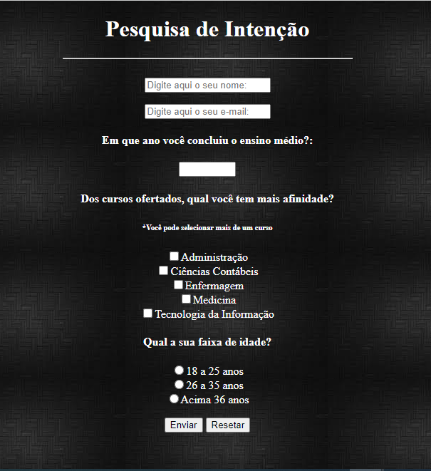

# Modelo Formulário Html/Css

Modelo de formulário em html/Css desenvolvido como requisito de prova dissertativa do curso de FULLSTACK.
O formulário foi desenvolvido seguindo as seuintes regras solicitadas:

* Deve possuir um campo para texto; um campo somente númerico. um campo para e-mail;
* Uma lista com 5 checkbox; 
* Um radiobutton com 3 opções, sendo somente um deles possível de selecionar por vez; 
* Crie um botão de submit e
* Um botão para limpar o formulário.


## Layout do Projeto



## Tecnologias utilizadas

Front End:  HTML e CSS

## Inspecionando o Html e Css

```
<!DOCTYPE html>
   <head>
	<title>2° Atividade HtmlCss</title>
	<meta charset="utf-8">
	<meta name="viewport" content="width=device-width, initial-scale=1.0">
	<link rel="stylesheet" type="text/css" href="css.css"/><!-- link arquivo .css--> 
   </head>
   <body>
	<h1>Pesquisa de Intenção</h1>
   	<hr>
	<br>
	<form method="post" action="mailto:exemplo@exemplo.com">
		<input type="text" name="Nome:" placeholder="Digite aqui o seu nome: "><p/>
		<input type="email" name="Email" placeholder="Digite aqui o seu e-mail: "><p/>
		<h4>Em que ano você concluiu o ensino médio?: </h4><p/>
			<input type="number" name="AnoTerminoEnsinoMedio" min=1990 max="2022"><p/>
		<div class="curso">
			<h4>Dos cursos ofertados, qual você tem mais afinidade? </h4>
			<h6>*Você pode selecionar mais de um curso</h6>
			<input type="checkbox" name="CursoAdministracao">Administração<br>
			<input type="checkbox" name="CursoCienciasContabeis">Ciências Contábeis<br>
			<input type="checkbox" name="CursoEnfermagem">Enfermagem<br>
			<input type="checkbox" name="CursoMedicina">Medicina<br>
			<input type="checkbox" name="CursoTi">Tecnologia da Informação
		</div class="idade">
			<h4>Qual a sua faixa de idade? </h4>
			<input type="radio" name="FaixaIdade" value="18_25">18 a 25 anos<br>
			<input type="radio" name="FaixaIdade" value="16_35">26 a 35 anos<br>
			<input type="radio" name="FaixaIdade" value="Acima36">Acima 36 anos
			<p/>

			<input type="submit" name="Enviar" value="Enviar">
			<input type="reset" name="<Limpar" value="Resetar">
	</form>
   </body>
</html>
```

```
body{text-align: center;
	 color: white;
	 background-image: url(img.jpg);}

hr{width: 30%;}
```
## Autor

Adalto Carvalho Ribeiro Simão Junior - Out.22

